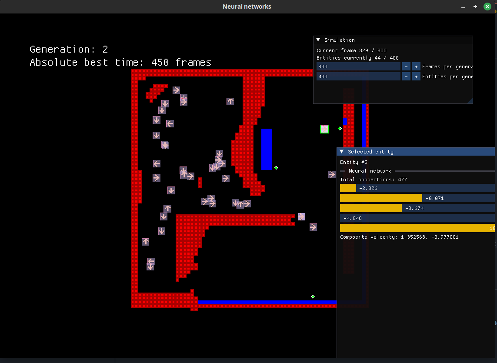

# Neural Networks V2
Fully based on an old project I got back at for some time.

## Installation
1. Install X11 (system specific)
    sudo dnf install \
        libX11-devel \
        libXrandr-devel \
        libXi-devel \
        libXcursor-devel \
        libXinerama-devel

2. Build SFML 3
    git clone https://github.com/SFML/SFML.git --branch master
    cd SFML && cmake -B build -DCMAKE_BUILD_TYPE=Release
    cmake --build build -j
    sudo cmake --install build

## Simulation
Map:
- Red squares = walls.
    - Removes entity health points.
- Blue squares = goals
    - The faster an entity touches one of these, the better it is
    
Entity:
- Dies if:
    - No health points
    - In too short of a radius (100 px) from the starting position after some time (100 frames) from start of simulation

Generation:
- Ends when frames per generation runs out
    - The best entity is selected, by finding the one which reached the goal the fastest

## Neural Network
Entity input neurons:
| Input Neuron    | Function |
| -------- | ------- |
| 0  |  x distance from wall (if dist < 50)   |
| 1 |  y distance from wall (if dist < 50)   |
| 2    |  x position   |
| 3    |  y position   |
| 4    |  current time in generation (0.0-1.0)   |

Entity output neurons:
| Output Neuron    | Function |
| -------- | ------- |
| 0  | x speed    |
| 1 | y speed    |
| 2    | (Unused)    |
| 3    | (Unused)    |
| 4    | (Unused)    |

## Usage
Run with CMake